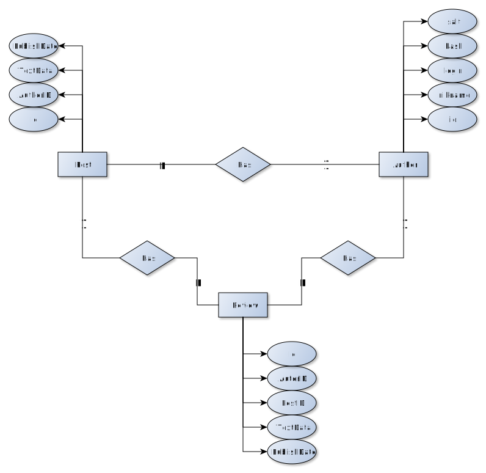

 Платформа для размещения развлекательного контента ()

# Лабораторная работа № 1

## Краткое описание идеи проекта

Необходимо спроектировать и разработать приложение для взаимодействия с записями, которые содержат развлекательный контент. Пользователь должен иметь возможность просматривать, создавать, удалять и комментировать записи.

## Краткое описание предметной области

Предметной областью является социальная жизнь. Неотъемлемой частью которой, является общение в соцсетях.

## Краткий анализ аналоговых решений по 3 критериям

| Название | добавление записей | комментирование записей | существование модератора | возможность ставить "лайки" |
|-----|----|-----|----|----|
| pikabu.ru | + | + | + | + |
| zen.yandex.ru | + | + | + | + |
| ok.ru | + | + | + | + |
| livejournal.com | + | + | + | + |
| Мое решение | + | + | + | - |

## Краткое обоснование целесообразнасти и актуальности проекта

В настоящее время огромную популярность имеют социальные сети,
форумы и, так называемые, имиджборды. Все они позволяют людям общаться
между собой из разных точек земли, делится разного рода цифровым
контентом, оценивать работы художников и писателей или обсуждать новости.
Из этого следует, что общение в социальных сетях сегодня стало неотъемлемой
частью жизни современного человека.

## Use-Case - диаграмма

## ER-диаграмма сущностей

## Архитектурные характеристики, важные для проекта.

Web-приложение.

### Технологический стек

**Back-end**:  TypeScript/Express/Node-postgres

**Front-end**: React.js

**Data base**: PostgreSQL

**Среда разработки**: Visual Studio Code

# Лабораторная работа № 2

## Бизнес-логика

## Доступ к данным

